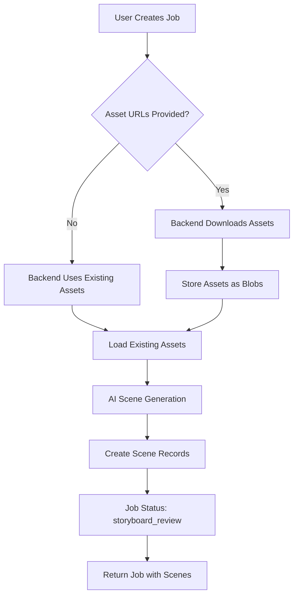

# V3 Complete Workflow - Visual Guide

**Date:** 2025-11-19
**Purpose:** Visual representation of complete V3 job workflow

---

## Job Creation Flow with Asset URLs



---

## Detailed Scene Generation Flow

```
┌─────────────────────────────────────────────────────────────┐
│                     1. USER CREATES JOB                      │
│                                                               │
│  POST /api/v3/jobs                                           │
│  {                                                            │
│    "context": {"clientId": "123"},                           │
│    "adBasics": {                                             │
│      "product": "Smart Watch",                               │
│      "targetAudience": "Tech enthusiasts",                   │
│      "keyMessage": "Stay connected",                         │
│      "callToAction": "Buy Now"                               │
│    },                                                         │
│    "creative": {                                             │
│      "direction": {                                          │
│        "style": "Modern",                                    │
│        "tone": "Energetic"                                   │
│      },                                                       │
│      "assets": [                                             │
│        {                                                     │
│          "url": "https://cdn.com/product.jpg",              │
│          "type": "image",                                    │
│          "name": "Product Hero"                              │
│        },                                                    │
│        {                                                     │
│          "url": "https://cdn.com/lifestyle.mp4",            │
│          "type": "video",                                    │
│          "name": "Lifestyle Clip"                            │
│        }                                                     │
│      ]                                                       │
│    }                                                         │
│  }                                                           │
└─────────────────────────────────────────────────────────────┘
                            │
                            ▼
┌─────────────────────────────────────────────────────────────┐
│               2. BACKEND DOWNLOADS ASSETS                    │
│                                                               │
│  For each asset URL:                                         │
│    ├─ Download from URL                                      │
│    ├─ Validate file type                                     │
│    ├─ Extract metadata (size, dimensions, duration)          │
│    ├─ Store as blob in asset_blobs table                    │
│    ├─ Create asset record                                    │
│    └─ Generate UUID                                          │
│                                                               │
│  Result:                                                      │
│    ├─ asset-uuid-1 (product.jpg stored as blob)             │
│    └─ asset-uuid-2 (lifestyle.mp4 stored as blob)           │
└─────────────────────────────────────────────────────────────┘
                            │
                            ▼
┌─────────────────────────────────────────────────────────────┐
│               3. AI GENERATES SCENE PLAN                     │
│                                                               │
│  AI analyzes:                                                │
│    ├─ Product: "Smart Watch"                                 │
│    ├─ Audience: "Tech enthusiasts"                           │
│    ├─ Message: "Stay connected"                              │
│    ├─ Style: "Modern"                                        │
│    ├─ Tone: "Energetic"                                      │
│    └─ Available assets: 2 (1 image, 1 video)                │
│                                                               │
│  AI generates 4 scenes:                                      │
└─────────────────────────────────────────────────────────────┘
                            │
                            ▼
┌─────────────────────────────────────────────────────────────┐
│                    4. SCENES CREATED                         │
│                                                               │
│  Scene 1: [6s]                                               │
│    Description: "Wide shot of urban professional checking    │
│                  smart watch while commuting"                │
│    Script: "Life moves fast in the city."                   │
│    Shot: Wide                                                 │
│    Assets: [lifestyle.mp4]                                   │
│    Transition: Fade in                                       │
│                                                               │
│  Scene 2: [8s]                                               │
│    Description: "Close-up of smart watch display showing     │
│                  notifications and fitness tracking"         │
│    Script: "Stay connected to what matters most."           │
│    Shot: Close-up                                            │
│    Assets: [product.jpg]                                     │
│    Transition: Cut                                           │
│                                                               │
│  Scene 3: [10s]                                              │
│    Description: "Dynamic montage of person using watch       │
│                  features throughout the day"                │
│    Script: "Fitness tracking. Message alerts. Music          │
│              control. All in one."                           │
│    Shot: Montage                                             │
│    Assets: [lifestyle.mp4, product.jpg]                      │
│    Transition: Fast cuts                                     │
│                                                               │
│  Scene 4: [6s]                                               │
│    Description: "Product shot with branding and call to      │
│                  action text overlay"                        │
│    Script: "Buy Now at SmartWatch.com"                      │
│    Shot: Product feature                                     │
│    Assets: [product.jpg]                                     │
│    Transition: Fade out                                      │
└─────────────────────────────────────────────────────────────┘
                            │
                            ▼
┌─────────────────────────────────────────────────────────────┐
│            5. JOB RETURNED WITH SCENES                       │
│                                                               │
│  Status: "storyboard_review"                                 │
│  Scenes: [4 scenes with details]                             │
│  Assets: [2 assets with V3 URLs]                             │
│                                                               │
│  Frontend displays storyboard for user approval              │
└─────────────────────────────────────────────────────────────┘
```

---

## Storyboard Approval Flow

```
┌─────────────────────────────────────────────────────────────┐
│           USER REVIEWS STORYBOARD (Frontend UI)              │
│                                                               │
│  Displays:                                                    │
│    ├─ Scene 1: [Wide shot] "Life moves fast..."             │
│    ├─ Scene 2: [Close-up] "Stay connected..."               │
│    ├─ Scene 3: [Montage] "Fitness tracking..."              │
│    └─ Scene 4: [Product] "Buy Now..."                        │
│                                                               │
│  User Options:                                               │
│    1. Approve → Move to rendering                            │
│    2. Regenerate Scene → Generate new scene                  │
│    3. Regenerate All → Generate all new scenes               │
│    4. Reject → Provide feedback & regenerate all             │
└─────────────────────────────────────────────────────────────┘
                            │
                ┌───────────┴───────────┐
                │                       │
                ▼                       ▼
    ┌────────────────────┐   ┌──────────────────────┐
    │   USER APPROVES    │   │ USER WANTS CHANGES   │
    └────────────────────┘   └──────────────────────┘
                │                       │
                │                       ▼
                │           ┌──────────────────────────┐
                │           │ POST /actions             │
                │           │ {                         │
                │           │   "action": "regenerate", │
                │           │   "sceneNumber": 2,       │
                │           │   "feedback": "More       │
                │           │    energetic"             │
                │           │ }                         │
                │           └──────────────────────────┘
                │                       │
                │                       ▼
                │           ┌──────────────────────────┐
                │           │ AI REGENERATES SCENE 2   │
                │           │ with new description     │
                │           └──────────────────────────┘
                │                       │
                │                       ▼
                │           ┌──────────────────────────┐
                │           │ Return updated job with  │
                │           │ new Scene 2              │
                │           └──────────────────────────┘
                │                       │
                │                       ▼
                │           ┌──────────────────────────┐
                │           │ User reviews again       │
                │           └──────────────────────────┘
                │                       │
                └───────────────────────┘
                            │
                            ▼
┌─────────────────────────────────────────────────────────────┐
│               STORYBOARD APPROVED                            │
│                                                               │
│  POST /api/v3/jobs/{id}/actions                             │
│  {"action": "approve_storyboard"}                           │
│                                                               │
│  Backend:                                                     │
│    ├─ Locks scenes (no more regeneration)                    │
│    ├─ Updates status: "in_progress"                          │
│    ├─ Triggers video rendering pipeline                      │
│    └─ Returns updated job                                    │
└─────────────────────────────────────────────────────────────┘
                            │
                            ▼
┌─────────────────────────────────────────────────────────────┐
│                  VIDEO RENDERING                             │
│                                                               │
│  Status: "rendering"                                         │
│  Progress: 0% → 25% → 50% → 75% → 100%                      │
│                                                               │
│  Frontend polls GET /api/v3/jobs/{id} for progress          │
└─────────────────────────────────────────────────────────────┘
                            │
                            ▼
┌─────────────────────────────────────────────────────────────┐
│                   JOB COMPLETED                              │
│                                                               │
│  Status: "completed"                                         │
│  Video URL: /api/v3/jobs/{id}/video                         │
│  Cost: $3.02                                                 │
└─────────────────────────────────────────────────────────────┘
```

---

## Asset Storage Architecture

```
┌──────────────────────────────────────────────────────────────┐
│                        BEFORE (V2)                            │
│                                                                │
│  Frontend                     Backend                         │
│     │                            │                            │
│     │ GET /api/v2/assets/123    │                            │
│     │──────────────────────────>│                            │
│     │                            │                            │
│     │                            │ Read file from disk       │
│     │                            │ /uploads/abc-123.jpg      │
│     │                            │                            │
│     │<──────────────────────────│                            │
│     │  Returns file data         │                            │
│                                                                │
│  Issues:                                                       │
│    - Files on disk (not portable)                            │
│    - V2 URL format                                            │
│    - No centralized blob management                           │
└──────────────────────────────────────────────────────────────┘

┌──────────────────────────────────────────────────────────────┐
│                        AFTER (V3)                             │
│                                                                │
│  Frontend                     Backend                         │
│     │                            │                            │
│  1. Create job with asset URL   │                            │
│     │ POST /api/v3/jobs          │                            │
│     │ {                          │                            │
│     │   "creative": {            │                            │
│     │     "assets": [{           │                            │
│     │       "url": "https://..." │                            │
│     │     }]                     │                            │
│     │   }                        │                            │
│     │ }                          │                            │
│     │──────────────────────────>│                            │
│     │                            │                            │
│     │                            │ 2. Download asset          │
│     │                            │    from URL                │
│     │                            │                            │
│     │                            │ 3. Store in asset_blobs    │
│     │                            │    INSERT INTO             │
│     │                            │    asset_blobs (data)      │
│     │                            │                            │
│     │                            │ 4. Create asset record     │
│     │                            │    INSERT INTO assets      │
│     │                            │    (blob_id, source_url)   │
│     │                            │                            │
│     │<──────────────────────────│                            │
│     │  Returns job with          │                            │
│     │  asset V3 URLs             │                            │
│     │                            │                            │
│  5. Display storyboard           │                            │
│     │ GET /api/v3/assets/        │                            │
│     │     uuid-123/data          │                            │
│     │──────────────────────────>│                            │
│     │                            │                            │
│     │                            │ 6. Retrieve blob           │
│     │                            │    SELECT data FROM        │
│     │                            │    asset_blobs WHERE ...   │
│     │                            │                            │
│     │<──────────────────────────│                            │
│     │  Returns blob data         │                            │
│                                                                │
│  Benefits:                                                     │
│    ✓ Assets stored as blobs (portable)                       │
│    ✓ V3 URL format throughout                                 │
│    ✓ Centralized blob management                              │
│    ✓ Easy migration to S3 later                               │
└──────────────────────────────────────────────────────────────┘
```

---

## Database Schema Relationships

```
┌─────────────────────┐
│     asset_blobs     │
│─────────────────────│
│ id (PK)             │◄─────┐
│ data (BYTEA)        │      │
│ content_type        │      │
│ size_bytes          │      │
│ created_at          │      │
└─────────────────────┘      │
                              │
                              │ blob_id (FK)
                              │
┌─────────────────────────────┴────────────┐
│                 assets                    │
│───────────────────────────────────────────│
│ id (PK)                                   │
│ user_id                                   │
│ client_id (nullable)                      │
│ campaign_id (nullable)                    │
│ name                                      │
│ type                                      │
│ format                                    │
│ blob_id (FK) ──────────────┘              │
│ source_url (original URL)                 │
│ url (generated V3 URL)                    │
│ size                                      │
│ width, height                             │
│ tags                                      │
│ created_at                                │
└───────────────────────────────────────────┘
                    │
                    │ Multiple assets can
                    │ belong to a job via
                    │ scene.assets JSONB array
                    │
                    ▼
┌───────────────────────────────────────────┐
│                 jobs                      │
│───────────────────────────────────────────│
│ id (PK)                                   │
│ user_id                                   │
│ client_id                                 │
│ campaign_id                               │
│ status                                    │
│ context (JSONB)                           │
│ ad_basics (JSONB)                         │
│ creative (JSONB)                          │
│ cost                                      │
│ created_at                                │
└───────────────────────────────────────────┘
                    │
                    │ One-to-many
                    │
                    ▼
┌───────────────────────────────────────────┐
│              job_scenes                   │
│───────────────────────────────────────────│
│ id (PK)                                   │
│ job_id (FK) ──────────────────────┘       │
│ scene_number (unique per job)             │
│ duration_seconds                          │
│ description                               │
│ script                                    │
│ shot_type                                 │
│ transition                                │
│ assets (JSONB array of asset IDs)         │
│ metadata (JSONB)                          │
│ created_at                                │
└───────────────────────────────────────────┘
```

---

## API Endpoint Organization

```
V3 API Endpoints
├─ /api/v3/clients
│  ├─ GET    /                    List clients
│  ├─ POST   /                    Create client
│  ├─ GET    /{id}                Get client
│  ├─ PUT    /{id}                Update client
│  ├─ DELETE /{id}                Delete client
│  └─ GET    /{id}/stats          Get client stats
│
├─ /api/v3/campaigns
│  ├─ GET    /                    List campaigns
│  ├─ POST   /                    Create campaign
│  ├─ GET    /{id}                Get campaign
│  ├─ PUT    /{id}                Update campaign
│  ├─ DELETE /{id}                Delete campaign
│  └─ GET    /{id}/stats          Get campaign stats
│
├─ /api/v3/assets
│  ├─ GET    /                    List assets
│  ├─ POST   /                    Upload asset (file or URL)
│  ├─ GET    /{id}                Get asset metadata
│  ├─ GET    /{id}/data           ⭐ NEW: Get asset blob
│  └─ DELETE /{id}                Delete asset
│
└─ /api/v3/jobs
   ├─ POST   /                    Create job (generates scenes)
   ├─ POST   /dry-run             Cost estimation
   ├─ GET    /{id}                Get job status (with scenes)
   ├─ POST   /{id}/actions        Job actions:
   │  │                           - regenerate_scene
   │  │                           - regenerate_all_scenes
   │  │                           - approve_storyboard
   │  │                           - reject_storyboard
   │  │                           - cancel
   │  └─ GET    /{id}/video       Get final video
   │
   └─ /api/v3/jobs/{id}/scenes    ⭐ NEW: Scene management
      ├─ GET    /                 List all scenes
      ├─ GET    /{scene_number}   Get specific scene
      └─ PUT    /{scene_number}   Update scene
```

---

## Scene Generation AI Prompt Example

```
SYSTEM PROMPT:
You are a professional video advertising creative director. Generate a compelling
video ad storyboard with 3-7 scenes based on the provided context.

USER PROMPT:
Create a video ad storyboard for:

Product: Smart Watch
Target Audience: Tech-savvy professionals aged 25-40
Key Message: Stay connected to what matters most
Call to Action: Buy Now at SmartWatch.com

Creative Direction:
- Style: Modern and sleek
- Tone: Energetic and inspiring
- Visual Elements: Product shots, lifestyle imagery, urban environment

Available Assets:
1. Product hero image (smart watch on display)
2. Lifestyle video clip (person using watch while commuting)

Requirements:
- Total duration: 30 seconds
- 3-7 scenes
- Each scene should have:
  * Duration (seconds)
  * Visual description
  * Script/voiceover text
  * Shot type (wide, close-up, montage, etc.)
  * Transition type
  * Asset assignment (which assets to use)

AI RESPONSE FORMAT:
{
  "scenes": [
    {
      "sceneNumber": 1,
      "duration": 6.0,
      "description": "...",
      "script": "...",
      "shotType": "...",
      "transition": "...",
      "assets": ["asset-uuid-1"]
    }
  ]
}
```

---

## Status Flow Diagram

```
┌────────────┐
│   PENDING  │  Initial state when job created
└─────┬──────┘
      │
      │ Backend generates scenes
      ▼
┌─────────────────┐
│ STORYBOARD_     │  User reviews and can regenerate scenes
│ REVIEW          │
└─────┬───────────┘
      │
      │ User approves storyboard
      ▼
┌────────────┐
│ IN_PROGRESS│  Video rendering starts
└─────┬──────┘
      │
      │ Rendering in progress
      ▼
┌────────────┐
│ RENDERING  │  Creating video from scenes
└─────┬──────┘
      │
      │ Rendering complete
      ▼
┌────────────┐
│ COMPLETED  │  Video ready for download
└────────────┘

Alternative paths:
┌────────────┐
│ FAILED     │  Error during processing
└────────────┘

┌────────────┐
│ CANCELLED  │  User cancelled job
└────────────┘
```

---

## Frontend UI Mockup Flow

```
1. Job Creation Form
┌─────────────────────────────────────────────┐
│ Create Video Ad                              │
├─────────────────────────────────────────────┤
│ Client: [Dropdown: ACME Corp]               │
│ Campaign: [Dropdown: Q4 2025 Launch]        │
│                                              │
│ Product: [Smart Watch                    ]  │
│ Audience: [Tech enthusiasts 25-40       ]  │
│ Message: [Stay connected              ]  │
│ CTA: [Buy Now                            ]  │
│                                              │
│ Style: [Modern                           ]  │
│ Tone: [Energetic (optional)             ]  │
│                                              │
│ Assets:                                      │
│ [+ Add URL] [+ Upload File]                 │
│                                              │
│ ┌─────────────────────────────────────────┐ │
│ │ 🖼️  product-hero.jpg                    │ │
│ │ https://cdn.example.com/hero.jpg       │ │
│ │ [Remove]                                 │ │
│ └─────────────────────────────────────────┘ │
│                                              │
│ [Cancel]              [Create Video Ad]     │
└─────────────────────────────────────────────┘
                    │
                    ▼
2. Scene Review / Storyboard
┌─────────────────────────────────────────────┐
│ Storyboard Review - Smart Watch Ad          │
├─────────────────────────────────────────────┤
│                                              │
│ Scene 1 (6s)                     [Regenerate]│
│ ┌─────────────────────────────────────────┐ │
│ │ 🎬 Wide shot of urban professional      │ │
│ │    checking watch while commuting       │ │
│ │                                          │ │
│ │ 🗣️  "Life moves fast in the city."     │ │
│ └─────────────────────────────────────────┘ │
│                                              │
│ Scene 2 (8s)                     [Regenerate]│
│ ┌─────────────────────────────────────────┐ │
│ │ 🎬 Close-up of smart watch display      │ │
│ │    showing notifications                │ │
│ │                                          │ │
│ │ 🗣️  "Stay connected to what matters."  │ │
│ └─────────────────────────────────────────┘ │
│                                              │
│ Scene 3 (10s)                    [Regenerate]│
│ ┌─────────────────────────────────────────┐ │
│ │ 🎬 Dynamic montage of features          │ │
│ │                                          │ │
│ │ 🗣️  "Fitness. Messages. Music."        │ │
│ └─────────────────────────────────────────┘ │
│                                              │
│ Scene 4 (6s)                     [Regenerate]│
│ ┌─────────────────────────────────────────┐ │
│ │ 🎬 Product shot with CTA overlay        │ │
│ │                                          │ │
│ │ 🗣️  "Buy Now at SmartWatch.com"        │ │
│ └─────────────────────────────────────────┘ │
│                                              │
│ [Regenerate All]    [Reject]  [Approve ✓]   │
└─────────────────────────────────────────────┘
                    │
                    ▼
3. Rendering Progress
┌─────────────────────────────────────────────┐
│ Creating Your Video Ad                       │
├─────────────────────────────────────────────┤
│                                              │
│ Status: Rendering                            │
│                                              │
│ ████████████████░░░░░░░░  67%               │
│                                              │
│ Estimated time remaining: 2 minutes          │
│                                              │
│ [Cancel Job]                                 │
└─────────────────────────────────────────────┘
                    │
                    ▼
4. Completed
┌─────────────────────────────────────────────┐
│ Video Ready! 🎉                              │
├─────────────────────────────────────────────┤
│                                              │
│ ┌─────────────────────────────────────────┐ │
│ │                                          │ │
│ │         [▶️  Play Video]                │ │
│ │                                          │ │
│ │         Smart Watch Ad                   │ │
│ │         Duration: 30s                    │ │
│ │         Cost: $3.02                      │ │
│ └─────────────────────────────────────────┘ │
│                                              │
│ [Download MP4]  [Share Link]  [Create New]  │
└─────────────────────────────────────────────┘
```

---

## Quick Reference: Key Changes from Current V3

| Feature | Current V3 | Required V3 |
|---------|-----------|-------------|
| Asset URLs | Manual upload only | Accept URLs, auto-download |
| Asset Storage | File system (V2 path) | Blob in database + V3 URL |
| Asset Serving | `/api/v2/assets/{id}` | `/api/v3/assets/{id}/data` |
| Scene Generation | Not implemented | AI-generated on job creation |
| Scenes in Job | Not returned | Included in job status |
| Scene Regeneration | Placeholder | Functional with AI |
| Storyboard Approval | Not implemented | Approve/reject actions |
| Job Creation Response | Basic job info | Job + generated scenes |

---

**Next Steps:**
1. Backend team reviews workflow
2. Confirms AI/LLM provider choice
3. Confirms blob storage strategy (Postgres vs S3)
4. Provides implementation timeline
5. Begins Phase 1 development

**Frontend Status:** Documentation complete, ready to adapt UI
